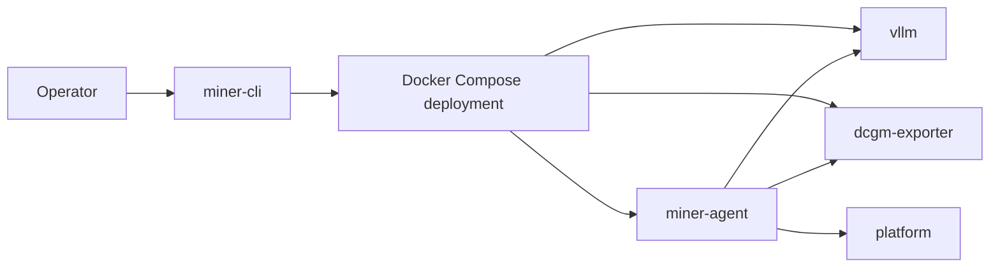
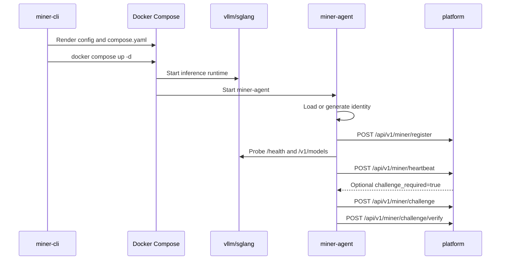

# Topology and Flows

This document describes the three-container deployment topology and startup flow of miner nodes.

## Architecture Overview

The miner node uses a three-container topology generated by `miner-cli`:

Container responsibilities:

- **Inference runtime**: Serves the model and exposes OpenAI-compatible endpoints
- **dcgm-exporter**: Provides GPU metrics
- **miner-agent**: Reads runtime and metrics state, sends signed registration, heartbeat, and challenge data to the platform

## Agent Responsibilities

`miner-agent` is not a process supervisor for the model runtime. Its core responsibilities include:

- Loading or generating identity from `${MINER_HOME}/config.json`
- Registering the node
- Sending signed heartbeats on a fixed interval
- Pulling and answering challenges when required by the control plane
- Probing runtime state through `/metrics`
- Reading GPU metrics from `dcgm-exporter`
- Exposing local health, readiness, identity, and control APIs

:::warning Custom Identity
To use a custom identity, mount the `${MINER_HOME}` directory and provide a custom `config.json` file.
:::

## Startup Flow

## Readiness Model

The `/readyz` endpoint returns `503` when:

- The node has not registered yet
- There is no recent successful heartbeat within `3 * MINER_HEARTBEAT_INTERVAL_SECONDS`
- A challenge is still pending

:::note
This readiness check describes the agent's control-plane health, not whether the model has sufficient capacity for production traffic.
:::

## Related Documentation

- [Miner Agent Overview](../miner-agent/overview)
- [Miner Agent Local API](../miner-agent/local-api)
- [Control Plane Contract](../reference/control-plane-contract)
