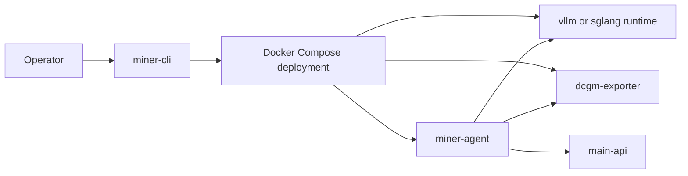
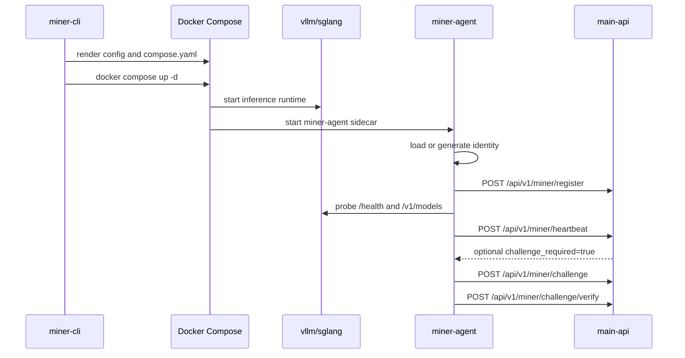

# Topology and Flows

The V1 miner node uses a fixed three-container topology generated by `miner-cli`.



## Runtime Responsibilities

The inference runtime serves the model and exposes OpenAI-compatible endpoints. `miner-cli` generates the launch command from the YAML config.

For `vllm`, the generated command includes:

- model id
- host and port
- tensor parallel size
- optional `--trust-remote-code`
- optional dtype
- optional max model length
- optional API key
- `extra_args` from the config

For `sglang`, the generated command uses `python -m sglang.launch_server` with equivalent host, port, model, tensor parallel, dtype, and context length settings.

## Metrics Responsibilities

When `dcgm_exporter.enabled=true`, `miner-cli` adds a `dcgm-exporter` service. The default metrics endpoint is:

```text
http://dcgm-exporter:9400/metrics
```

`miner-agent` reads this endpoint and reports parsed GPU metrics in the heartbeat payload.

## Agent Responsibilities

`miner-agent` is not a process supervisor for the model runtime. It observes the runtime and reports miner state:

- loads or generates identity from `${MINER_HOME}/config.json`
- registers the node with `main-api`
- sends signed heartbeats on a fixed interval
- pulls and answers challenges when required
- probes runtime health through `/health`, `/v1/models`, and optional `/load`
- reads GPU metrics from `dcgm-exporter`
- exposes local health, readiness, identity, and control APIs

## Startup Flow



## Readiness Model

The agent local `/readyz` endpoint returns `503` when:

- the node has not registered yet
- there is no recent successful heartbeat within `3 * MINER_HEARTBEAT_INTERVAL_SECONDS`
- a challenge is still pending

This readiness check describes the agent's control-plane health, not whether the model itself has enough capacity for production traffic.
