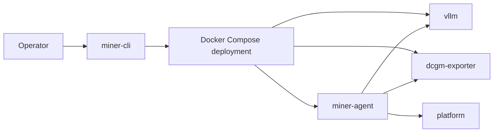

# Topology and Flows

The miner node uses a three-container topology generated by `miner-cli`.

The inference runtime serves the model and exposes OpenAI-compatible endpoints. `dcgm-exporter` provides GPU metrics. `miner-agent` reads runtime and metrics state, then sends signed registration, heartbeat, and challenge data to the platform.

## Agent Responsibilities

`miner-agent` is not a process supervisor for the model runtime. It observes the runtime and reports miner state:

- loads or generates identity from `${MINER_HOME}/config.json`; mount this directory and provide a custom `config.json` if you need a custom identity
- registers the node
- sends signed heartbeats on a fixed interval
- pulls and answers challenges when required
- probes runtime state through `/metrics`
- reads GPU metrics from `dcgm-exporter`
- exposes local health, readiness, identity, and control APIs

## Startup Flow

## Readiness Model

The agent local `/readyz` endpoint returns `503` when:

- the node has not registered yet
- there is no recent successful heartbeat within `3 * MINER_HEARTBEAT_INTERVAL_SECONDS`
- a challenge is still pending

This readiness check describes the agent's control-plane health, not whether the model itself has enough capacity for production traffic.
