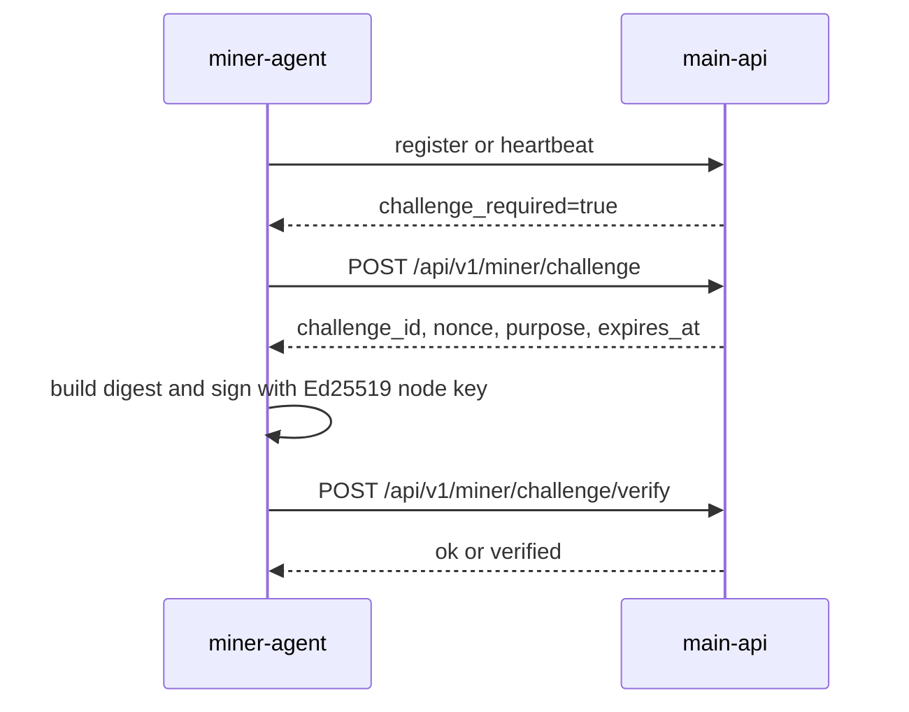

# Control Plane Contract

`miner-agent` sends signed JSON payloads to `main-api`.

## Outbound Paths

The current client prefixes miner routes with `/api/v1`:

| Method | Path | Purpose |
| --- | --- | --- |
| `POST` | `/api/v1/miner/register` | Register node identity, wallet address, public endpoint, runtime type, and GPU inventory. |
| `POST` | `/api/v1/miner/heartbeat` | Report signed host, GPU, runtime, and model status. |
| `POST` | `/api/v1/miner/challenge` | Request a challenge for registration or reverification. |
| `POST` | `/api/v1/miner/challenge/verify` | Submit a signed challenge answer. |

The source README refers to the same V1 route layout without the `/api/v1` prefix. The implementation currently uses the prefixed paths above.

## Registration Payload

The registration payload contains:

- `node_id`
- `node_public_key`
- `node_key_type`
- `wallet_address`
- `name`
- `public_ip`
- `agent_version`
- `runtime_type`
- `gpus`
- `timestamp`
- `nonce`
- `sign_result`

`node_public_key` is base64-encoded for the control plane. `sign_result` is produced by signing the canonical digest with the node Ed25519 private key.

## Heartbeat Payload

The heartbeat payload contains:

- `node_id`
- `timestamp`
- host metrics
- `gpus`
- `vllm`
- `nonce`
- `sign_result`

The `vllm` object includes runtime health, served models, model readiness, optional load data, and probe errors when a probe fails.

## Challenge Flow

Challenge answer signing uses:

- `challenge_id`
- `node_id`
- `nonce`
- `purpose`
- `expires_at`

If verification succeeds, the agent marks itself verified and clears the pending challenge flag.

## Error Behavior

HTTP failures during registration and heartbeat are stored in agent state and exposed through `/v1/miner/status` and `/readyz`.

If registration returns HTTP `409`, the client treats the node as registered but unverified and enters the challenge path.
