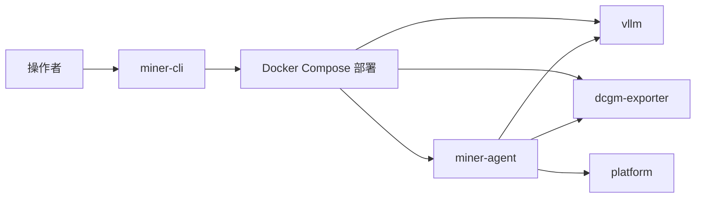
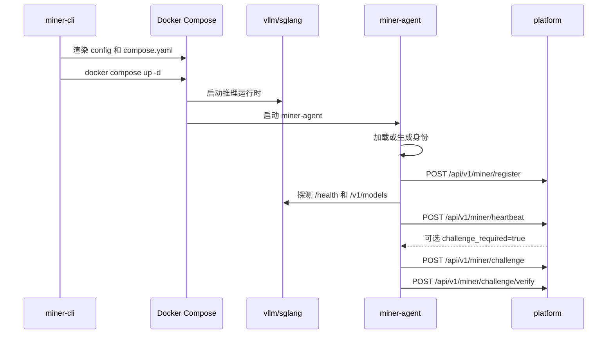

# 拓扑与流程

矿工节点使用由 `miner-cli` 生成的三容器拓扑。

推理运行时负责服务模型并暴露 OpenAI 兼容端点。`dcgm-exporter` 提供 GPU 指标。`miner-agent` 读取运行时和指标状态，并把签名后的注册、心跳和挑战数据发送给平台。

## Agent 职责

`miner-agent` 不负责管理模型进程生命周期。它负责：

- 从 `${MINER_HOME}/config.json` 加载或生成身份（如需自定义身份，需挂载该目录并自定义config.json文件）
- 注册节点
- 按固定间隔发送签名心跳
- 在控制面要求时拉取并回答挑战
- 通过 `/metrics` 探测运行时
- 从 `dcgm-exporter` 读取 GPU 指标
- 暴露本地健康、就绪、身份和控制 API

## 启动流程

## 就绪模型

`/readyz` 在以下场景返回 `503`：

- 节点尚未注册
- `3 * MINER_HEARTBEAT_INTERVAL_SECONDS` 内没有成功心跳
- 仍有待处理挑战

这个就绪检查描述的是 agent 控制面状态，不等同于模型是否有足够业务容量。
