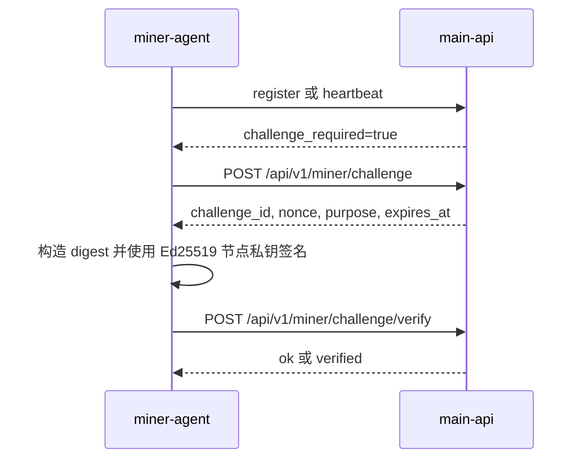

# 控制面契约

`miner-agent` 会向 `main-api` 发送签名 JSON payload。

## 出站路径

当前客户端为矿工路由添加 `/api/v1` 前缀：

| 方法 | 路径 | 用途 |
| --- | --- | --- |
| `POST` | `/api/v1/miner/register` | 注册节点身份、钱包地址、公网入口、运行时类型和 GPU inventory。 |
| `POST` | `/api/v1/miner/heartbeat` | 上报签名后的主机、GPU、运行时和模型状态。 |
| `POST` | `/api/v1/miner/challenge` | 为注册或重新验证请求挑战。 |
| `POST` | `/api/v1/miner/challenge/verify` | 提交签名后的挑战答案。 |

源 README 提到的是不带 `/api/v1` 前缀的 V1 route layout；当前实现使用上表中的前缀路径。

## 注册 Payload

注册 payload 包含：

- `node_id`
- `node_public_key`
- `node_key_type`
- `wallet_address`
- `name`
- `public_ip`
- `agent_version`
- `runtime_type`
- `gpus`
- `timestamp`
- `nonce`
- `sign_result`

`node_public_key` 以 base64 形式发送。`sign_result` 由节点 Ed25519 私钥对规范 digest 签名得到。

## 心跳 Payload

心跳 payload 包含：

- `node_id`
- `timestamp`
- 主机指标
- `gpus`
- `vllm`
- `nonce`
- `sign_result`

`vllm` 对象包含运行时健康、服务中的模型、模型就绪、可选 load 数据，以及探测失败时的错误信息。

## 挑战流程

挑战答案签名使用：

- `challenge_id`
- `node_id`
- `nonce`
- `purpose`
- `expires_at`

验证成功后，agent 会把自身标记为 verified，并清除 pending challenge 标记。

## 错误行为

注册和心跳的 HTTP 失败会写入 agent 状态，并通过 `/v1/miner/status` 和 `/readyz` 暴露。

如果注册返回 HTTP `409`，客户端会把节点视为已注册但未验证，并进入挑战路径。
